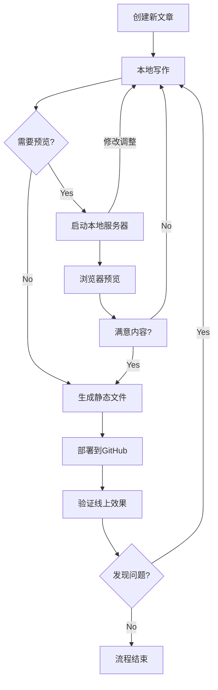

# Hexo 博客编写发布流程



## 详细步骤说明

### 1. 创建新文章

```
hexo new "文章标题"
```

- 自动在 `source/_posts` 生成 Markdown 文件
- 推荐使用英文文件名（如 `my-first-post.md`）

### 2. 本地写作

```
使用编辑器（VS Code/Typora等）编辑生成的 Markdown 文件
建议结构：
---
title: 示例文章
date: 2024-02-20
categories: [技术, 随笔]
tags: [Hexo, GitHub]
---
## 正文内容

```

### 3. 本地预览（可选）

```
hexo clean && hexo s
```

- 访问 `http://localhost:4000`
- 实时热重载（修改后自动刷新）

### 4. 生成静态文件

```
hexo clean && hexo g
```

- 生成最终网页到 `public` 目录
- 检查 `/public/index.html` 是否更新

### 5. 部署到 GitHub

```
hexo d
```

- 自动推送生成的文件到 `baopeg.github.io` 仓库
- 依赖 `_config.yml` 中的部署配置

### 6. 线上验证

```
访问 https://baopeg.top 检查：
1. 新文章是否显示
2. 排版是否正常
3. 图片是否加载
4. 分类/标签是否更新
```

## 配套命令速查表

| 操作            | 命令组合                    |
| :-------------- | :-------------------------- |
| 新文章+本地预览 | `hexo new "标题" && hexo s` |
| 快速部署        | `hexo clean && hexo g -d`   |
| 仅生成不部署    | `hexo g --watch`            |
| 强制覆盖部署    | `hexo d --force`            |

## 注意事项

1. 源文件备份建议：

   ```
   # 将整个Hexo项目（除node_modules）提交到私有仓库
   git init
   git remote add origin 你的私有仓库地址
   git add .
   git commit -m "备份博客源文件"
   git push -u origin main
   ```

2. 图片资源管理：

   - 推荐使用图床（如 [PicGo](https://picgo.github.io/)）
   - 或存放到 `source/images/` 目录
   - Markdown 引用格式：``

3. 自动 CI/CD 扩展建议：

   ```
   # 可添加 .github/workflows/deploy.yml 实现自动部署
   name: Hexo Deploy
   on: [push]
   jobs:
     build:
       runs-on: ubuntu-latest
       steps:
       - uses: actions/checkout@v2
       - uses: actions/setup-node@v2
         with:
           node-version: '16'
       - run: npm install
       - run: hexo clean && hexo deploy --generate
   ```

复制

```
这个流程图配合操作指南的特点：

1. **可视化流程**：使用 Mermaid 图形化展示完整工作流
2. **渐进式操作**：包含预览环节防止错误部署
3. **错误防御**：
   - 部署前自动执行 `hexo clean`
   - 强制清理旧缓存文件
4. **扩展建议**：包含自动化部署和源文件备份方案
5. **多端兼容**：命令行操作适配 Windows/macOS/Linux

建议在 VS Code 中安装 [Mermaid 插件](https://marketplace.visualstudio.com/items?itemName=bierner.markdown-mermaid) 获得最佳可视化效果。


